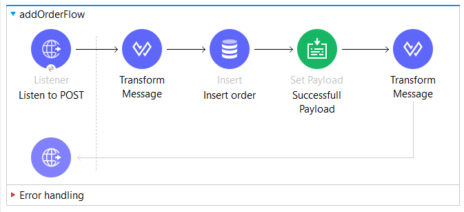
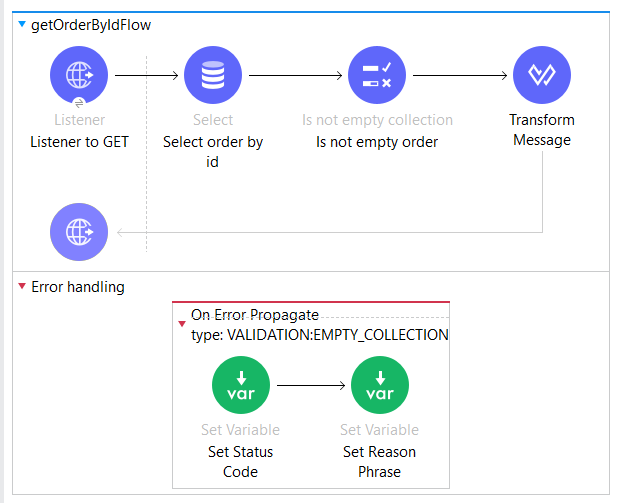
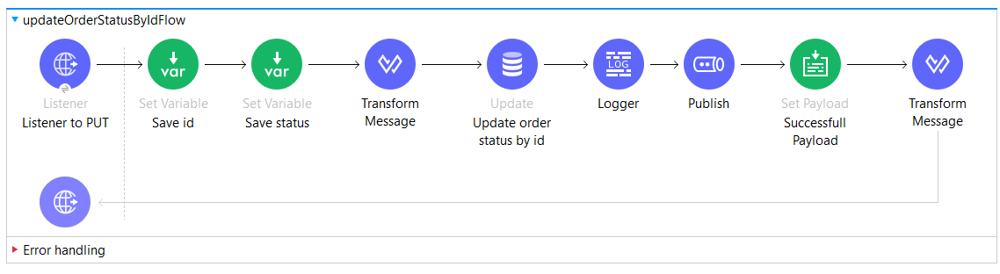
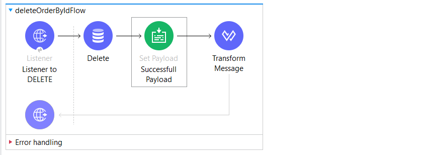
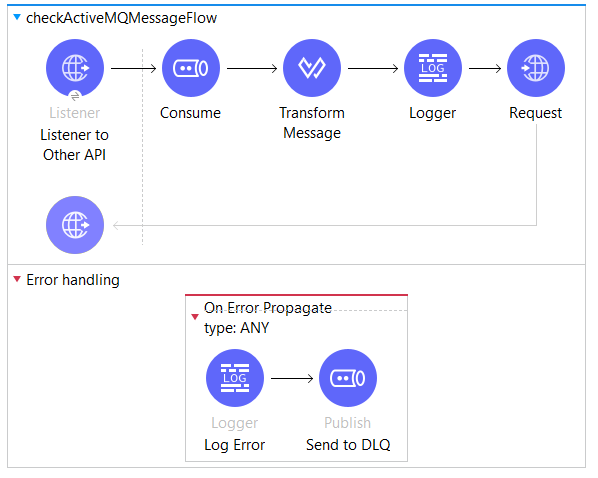
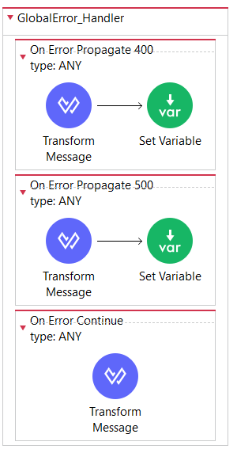

# Order API на MuleSoft

Этот проект представляет собой REST API для обработки заказов, разработанное на платформе MuleSoft Anypoint Platform.
API позволяет выполнять операции CRUD с заказами, используя PostgreSQL для хранения данных и ActiveMQ для обработки сообщений.

## Резюме по тестовому

- **Тестовое оказалось очень интересным**, никогда не работал с такой программой ранее, поэтому был очень рад узнать что-то новое
- **Основной проблемой** оказалось полное отсутствие материалов на русском языке. Спасибо почти понятной документации и видео индусов.
- **Проект выполнен не идеально.** Даже при написании README увидел пару моментов, которые можно улучшить.
- **В рамках ТЗ** не стал сильно наслаивать проект инструментами и прочими сложными фичами, т.к. ТЗ этого не требует.
- **Проект выполнялся на Windows**, поэтому вся инструкция написана для Windows.

## Возможности API

- **POST /orders** — создание нового заказа
- **GET /orders/{id}** — получение информации о заказе
- **PUT /orders/{id}/status** — обновление статуса заказа с отправкой сообщения в ActiveMQ
- **DELETE /orders/{id}** — удаление заказа

## Требования

- **MuleSoft Anypoint Studio 7.13+**
- **JDK 8+**
- **Maven**
- **Docker** (если запускается в контейнерах)
- **PostgreSQL 13+**
- **ActiveMQ**

## Поднятие проекта

### 1. Запуск в Docker

Используйте `docker-compose` для автоматического поднятия необходимых сервисов. Команды выполнять в консоли:

```sh
docker run -d \
  --name my-postgres \
  -e POSTGRES_USER=postgres \
  -e POSTGRES_PASSWORD=postgres \
  -e POSTGRES_DB=testdb \
  -p 5432:5432 \
  --restart unless-stopped \
  postgres:latest

docker run -d --name activemq -p 61616:61616 -p 8161:8161 \
  -e ACTIVEMQ_ADMIN_LOGIN=admin \
  -e ACTIVEMQ_ADMIN_PASSWORD=password \
  rmohr/activemq
```

После запуска контейнеров убедитесь, что PostgreSQL и ActiveMQ работают:
```sh
docker ps
```

Не забудьте создать таблицу `orders` в БД `testdb`:
```sql
CREATE TABLE orders (
    id SERIAL PRIMARY KEY,
    client VARCHAR(255),
    amount DECIMAL,
    status VARCHAR(50)
);
```

### 2. Запуск локально (без Docker)

1. **Настроить базу данных**  
   Установите PostgreSQL и создайте базу:
   ```sh
   psql -U postgres
   CREATE DATABASE testdb;
   ```
   Не забудьте создать таблицу `orders` в БД `testdb`:
   ```sql
   CREATE TABLE orders (
       id SERIAL PRIMARY KEY,
       client VARCHAR(255),
       amount DECIMAL,
       status VARCHAR(50)
   );
   ```
2. **Настроить ActiveMQ**  
   Установите ActiveMQ и запустите его:
   ```sh
   ./activemq start
   ```
3. **Настроить Anypoint Studio**  
   - Откройте проект в Anypoint Studio.
   - Убедитесь, что конфигурация Database Connector указывает на PostgreSQL (`localhost:5432`). Логин и пароль совпадают с БД.
   - Убедитесь, что конфигурация JMS Connector указывает на ActiveMQ (`tcp://localhost:61616`). Логин и пароль совпадают с брокером.
4. **Запустите Mule-приложение** через Anypoint Studio.

## Тестирование API

### 1. Создание заказа
```sh
curl --location 'http://localhost:8081/orders/add' \
--header 'Content-Type: application/json' \
--data '{
  "client": "Aboba",
  "amount": "15",
  "status": "pending"
}
'
```

**Flow в Anypoint Studio:**



**Описание Flow:**
- Отправляется запрос, как написано в `curl`
- Происходит сериализация в `Java объект`
- Происходит `Insert` в БД
- Payload заменяется на успешное сообщение об добавлении `order'а`
- Payload трансформируется в формат `application/json` и отправляется как ответ


### 2. Получение заказа
```sh
curl --location --request GET 'http://localhost:8081/orders/2' \
--header 'Content-Type: application/json' \
--data '
'
```

**Flow в Anypoint Studio:**



**Описание Flow:**
- Отправляется запрос, как написано в `curl`
- Происходит `Select` order'а из БД на основе `uriParams.id`
- Идет валидация на `непустую коллекцию`. Если валидация не проходит, то происходит выбрасывание ошибки, где заменяются код и тело ошибки
- Payload трансформируется в формат `application/json` и отправляется как ответ

### 3. Обновление статуса заказа
```sh
curl --location --request PUT 'http://localhost:8081/orders/6/status' \
--header 'Content-Type: application/json' \
--data '{
    "status": "fail"
}'
```

**Flow в Anypoint Studio:**



**Описание Flow:**
- Отправляется запрос, как написано в `curl`
- Происходит сохранение `id` и `status` в переменные
- Происходит сериализация в `Java объект`
- Совершаем `Update` в БД
- Логируется изменение статуса.
- Отправляем через `Publish` в `ActiveMQ` в очередь `orders.status.updates` данные `id` и `status`
- Payload заменяется на успешное сообщение об обновлении статуса `order'а`
- Payload трансформируется в формат `application/json` и отправляется как ответ

### 4. Удаление заказа
```sh
curl --location --request DELETE 'http://localhost:8081/orders/2' \
--data ''
```

**Flow в Anypoint Studio:**



**Описание Flow:**
- Отправляется запрос, как написано в `curl`
- Делаем `Delete` из БД
- Payload заменяется на успешное сообщение об удалении `order'а`
- Payload трансформируется в формат `application/json` и отправляется как ответ

### 5. Работа очереди ActiveMQ
```sh
curl --location --request POST 'http://localhost:8083/otherapi/process' \
--data ''
```

**Flow в Anypoint Studio:**

Данное flow необходимо, чтобы показать работу считывания сообщений из `ActiveMQ`



**Описание Flow:**
- Используем `Consume` для считывания сообщений
- Происходит сериализация в `Java объект`
- Логгируется успешное считывание сообщения с данными
- Отправляется запрос на `https://example.com`
- В случае ошибки логгируется сообщение об ошибке и отправляется в `DLQ`

### 6. Глобальный обработчик ошибок
**Flow в Anypoint Studio:**



**Описание Flow:**
- Были созданы все необходимые ошибки
- Сериализация в `application/json`
- Присваивание через `Set Variables` http статуса
- Обработчик был добавлен в `Global Elements` в `Configuration`
- Но настроено не до конца, `признаю свое поражение` при попытке сделать данное часть ТЗ

## Логирование сообщений из ActiveMQ

После обновления статуса заказов в ActiveMQ отправляется сообщение.
Для проверки работы можно использовать ActiveMQ Web Console:

- Откройте в браузере `http://localhost:8161/admin` (логин: `admin`, пароль: `password`).
- Перейдите в раздел `Queues` и проверьте сообщения.

## Обработка ошибок

- **400 Bad Request** – неверный формат входных данных.
- **404 Not Found** – заказ не найден.
- **500 Internal Server Error** – внутренняя ошибка сервера.

## Деплой

Проект можно собрать и запустить через Maven:
```sh
mvn clean package -DskipTests
```

Затем развернуть `target/your-api.jar` в Mule Runtime.

## Заключение

Этот проект демонстрирует интеграцию MuleSoft с PostgreSQL и ActiveMQ, а также работу с Docker. Все ключевые компоненты настроены для удобного развертывания и тестирования.


